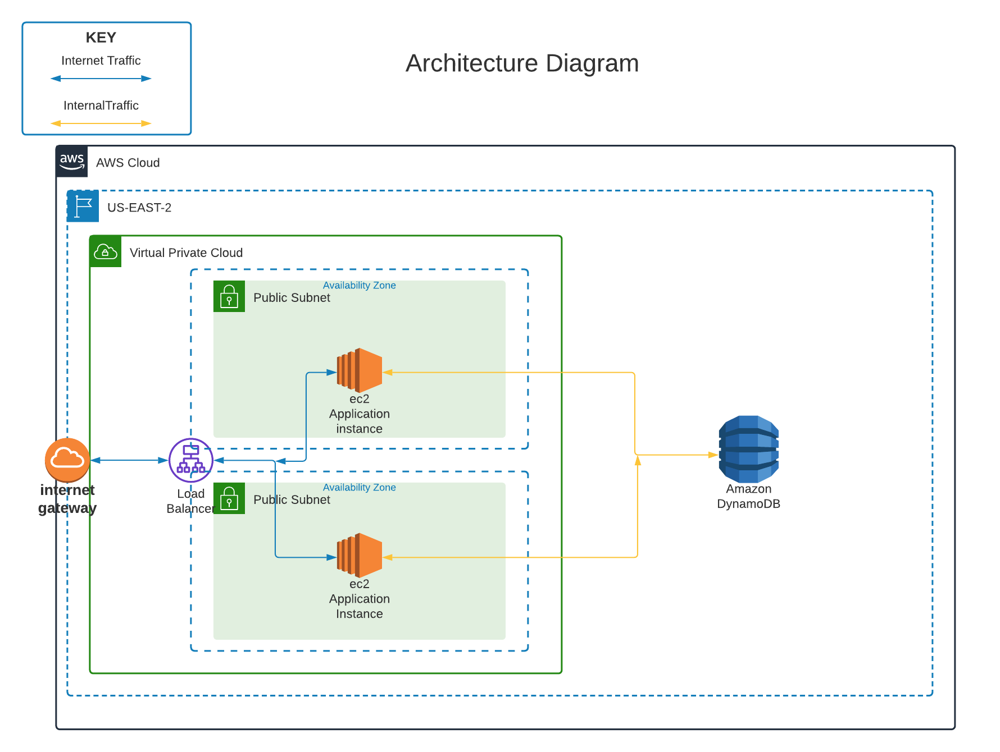

Cloud Engineer Technical Challenge - 202X
=========================================

# Requirements

- AWS Account
- AWS cli profile
- S3 bucket for tf backend
- S3 bucket for pipeline artifacts
- EC2 KeyPair (Not created in the repo for security concerns)

# Infrastructure Overview

## Infrastructe details
The compute environment is composed of an application load balancer with an autoscaling group of EC2s. Each instance registers as host onto ECS cluster.
DynamoDB table represents the storage layer.
The application has been containerized through Docker and is managed through ECS on EC2 hosts.
The Docker image is stored into an ECR.

## Pipeline Overview

In order to containerize the application from the source code, a Dockerfile and Buildspec have been added to the repository.
The pipeline is a basic solution over AWS services, it may be improved with:

- Lint/Quality pre-build check
- ECS Blue/Green deployment
- Full testing phase with temporary resource provisioning and dismissal
- Multi environment deployment stages (Dev -> Qa -> Prod)

# Documentation

## Setup

**IMPORTANT:** This is a mock project, modules are not currently bound to a specific versions.

- Update backend and desired versions in the respective files
- Update provider with aws_cli profile
- Create EC2 Key pair

A prefix based on the folder name is used to name resources. To change this prefix modify "locals.tf/prefix" .
Use the mock.tfvars.json in order to deploy.
- terraform workspace new mock
- terraform init
- terraform validate
- terraform plan
- terraform apply --var-file=./vars/mock.tfvars.json
- terraform destroy (clean-up)
In order to enable the pipeline, push onto the created codecommit repository the application folder (./tech-challenge-flask-app) onto "main" branch and manually approve the following deploy over ECS through codepipeline.

## Modules

| Name | Source | Version |
|------|--------|---------|
|  [vpc](#module\_vpc) | terraform-aws-modules/vpc/aws | latest |
|  [alb](#module\_alb) | terraform-aws-modules/alb/aws | 6.0 |

## Inputs

| Name | Description | Type | Default | Required |
|------|-------------|------|---------|:--------:|
| tags | tags for resources | map(string) | {"project" = "project_name", "env" = "mock"} | No |
| ec2_key_pair_name | EC2 Key Pair | string | N/A | Yes |
| ecs_cluster_name | ECS Cluster Name to be created | string | "cluster" | No |
| region | AWS Region to deploy resources | string | "us-east-2" | No |
| app_port | Listening port for the application | number | 8000 | No |
| instance_type | EC2 instance type for hosts | string | "t3.micro" | No |
| desired_instance_capacity | Number of EC2 instances desired [0:2] | number  | 2 | No |
| desired_tasks | Number of ECS tasks desired | number  | 2 | No |
| artifact_store | S3 bucket for pipeline artifacts | string | N/A | Yes |
| codebuild_image | Codebuild Image version | string | "aws/codebuild/standard:5.0" | No |
| healthcheck_path | Target group healthcheck | string | "/gtg" | No |

## Outputs

| Name | Description |
|------|-------------|
| lb_dns_name | Application load balancer dns name |
| app_url | http url to invoke the application |
| aws_ecr_repository | CodeCommit repository url for application code |

## Candidate
Jeanpierre Francois (github.com/Jean717p)

